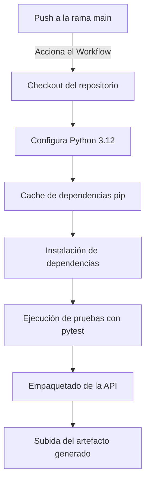

# FastAPI CI/CD Pipeline

## Resumen

Este flujo de trabajo de GitHub Actions automatiza el proceso de integración y entrega continua (CI/CD) para una API desarrollada con FastAPI. El pipeline incluye la instalación de dependencias, ejecución de pruebas, empaquetado del código y almacenamiento del artefacto resultante para su posterior despliegue.

### Diagrama del Proceso



## Objetivo del Pipeline

Este pipeline tiene como objetivo principal asegurar que el código de la API en FastAPI sea probado y empaquetado correctamente antes de ser desplegado en producción. La automatización de estos pasos garantiza que cada cambio en la rama `main` sea validado antes de su implementación.

## Configuración del Workflow

El workflow está definido en el archivo `.github/workflows/fastapi-cicd.yml` y se ejecuta automáticamente cuando se realiza un `push` a la rama `main`.

### Jobs y Pasos

#### 1. **Checkout del Código**
   - Se clona el repositorio para obtener la versión más reciente del código.FastAPI

```yaml
- uses: actions/checkout@v3
```

#### 2. **Configuración del Entorno de Python**
   - Se instala Python 3.12 en el runner de GitHub Actions.

```yaml
- name: Set up Python
  uses: actions/setup-python@v4
  with:
    python-version: '3.12'
```

#### 3. **Cache de Dependencias**
   - Se cachean las dependencias de pip para acelerar las futuras ejecuciones del workflow.

```yaml
- uses: actions/cache@v3
  with:
    path: ~/.cache/pip
    key: ${{ runner.os }}-pip-${{ hashFiles('**/requirements*.txt') }}
    restore-keys: |
      ${{ runner.os }}-pip-
```

#### 4. **Instalación de Dependencias**
   - Se actualiza `pip` y se instalan las dependencias listadas en `requirements.txt` dentro de un entorno virtual.

```yaml
- name: Install dependencies
  run: |
    python -m pip install --upgrade pip
    python -m venv venv
    source venv/bin/activate
    pip install -r requirements.txt
```

#### 5. **Ejecución de Pruebas**
   - Se ejecutan las pruebas unitarias utilizando `pytest`.

```yaml
- name: Run Tests
  run: |
    source venv/bin/activate
    pytest
```

#### 6. **Empaquetado de la API**
   - Se comprimen los archivos necesarios en un `zip` para su posterior despliegue.

```yaml
- name: Package API
  run: |
    cd ./venv/lib/python3.12/site-packages
    zip -r9 ../../../../api.zip .
    cd ../../../../api
    zip -g ../api.zip -r .
```

#### 7. **Subida del Artefacto**
   - Se almacena el archivo `api.zip` como un artefacto en GitHub Actions.

```yaml
- name: Upload artifact
  uses: actions/upload-artifact@v4
  with:
    name: api
    path: api.zip
```

## Beneficios del Pipeline

- **Automatización:** Reducción del trabajo manual en el despliegue de la API.
- **Estandarización:** Todos los cambios en `main` siguen el mismo proceso de validación.
- **Seguridad:** Se ejecutan pruebas antes de empaquetar la API.
- **Rapidez:** Uso de caché para acelerar la instalación de dependencias.

